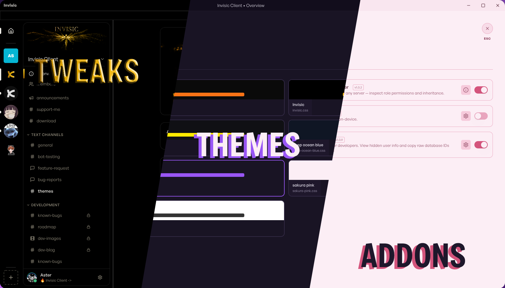

# Invisic Client

A highly customizable desktop client for Kloak.app, free and open source. <br>

 <br>

#### - Built in UI and Performance fixes!<br>

#### - Keep your friends organised with DM folders!<br>

#### - Choose from over 5 additional addons to enhance your experience <br>

Join the Invisic community server: https://kloak.app/invite/TDBS7JTK

## Installation:

**Linux:**<br>

1. Download the .Appimage (all distros) <br>
2. Right click and go to properties, check "Allow executing file as program"<br>
3. Open the file!<br>

**Windows:**<br>

1. Download the Invisic Setup.exe file<br>
2. Right click and Run as Administrator<br>
3. Wait for installation to complete!<br>

## Compiling yourself (linux):

Create build enviroment and clone repo:

```shell
mkdir invisic-client
git clone https://codeberg.org/adaster98/invisic-client
npm install
```

Test with:
`npm start`

Build with:
`npm run build`
