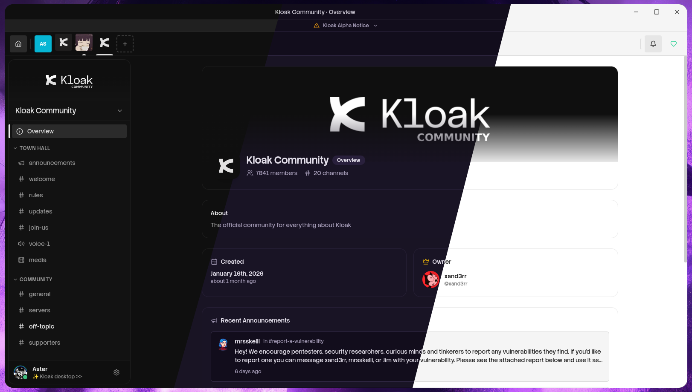
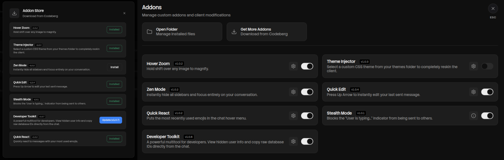

# Unofficial Kloak Client

Free and open source. <br>

 <br>

Now with an addon manager! Choose from many pre-made addons or create your own!


## Installation:

**Linux:**<br>

1. Download the .Appimage (all distros) or .deb (debian only). <br>
2. Right click and go to properties, check "AAllow executing file as program"<br>
3. Open the file!<br>

**Windows:**<br>

1. Download the Kloak Setup.exe file<br>
2. Right click and Run as Administrator<br>
3. Wait for installation to complete!<br>

## Compiling yourself (linux):

Create build enviroment and clone repo:

```shell
mkdir kloak-client
git clone https://codeberg.org/adaster98/kloak-client-unofficial/client
npm install
```

Test with:
`npm start`

Build with:
`npm run build`
